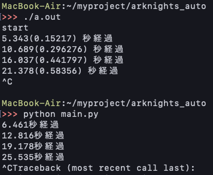

アークナイツ自動化のツールを作る際の履歴をメモしたもの。

pythonでpyautogui(pyscreeze)を使って作ったがどうやら`locateOnScreen`時に毎回screenshotをとっていて、非効率だしpcに負担かかりそう。なのでせっかくの機会なのでc++を使って新しく自動化機能を作りたいと思う。ちなみに下のコードがpythonで作ったコード。

```python
import time,pyautogui

start = time.time()
flag = 0
while(1):
    print("\n"+str(int(time.time()-start))+"秒経過")
    autoPos = pyautogui.locateCenterOnScreen("./image/auto.png", grayscale=True)
    stageDecidePos = pyautogui.locateCenterOnScreen("./image/stage_decide.png", grayscale=True)
    stageStartPos = pyautogui.locateCenterOnScreen("./image/stage_start.png", grayscale=True)
    resultPos = pyautogui.locateCenterOnScreen("./image/result.png", grayscale=True)
    if autoPos is not None:
        pyautogui.click(stageDecidePos[0],stageDecidePos[1])
        print("click stageDecide")
        flag = 0
    elif stageStartPos is not None:
        pyautogui.click(stageStartPos[0],stageStartPos[1])
        print("click stageStart")
        time.sleep(90)
        flag = 0
    elif resultPos is not None:
        pyautogui.click(resultPos[0],resultPos[1])
        print("click result")
        flag = 0
    else:
        flag += 1
        if flag > 20:
            break
    time.sleep(3)
```

### openCVを動かす
いろいろつまづいたが次の手順でやれば良い

1.Homebrewでインストール
```
brew install opencv
brew install pkg-config
```

2.コードを書く
```cpp
#include <stdio.h>
#include <opencv2/opencv.hpp>

int main() {
 cv::Mat img;

 img = cv::imread("example.png");

 cv::imshow("title", img);
 cv::waitKey(0);

 return 0;
}
```

3.コンパイル & 実行
```
g++ -std=c++11 main.cpp `pkg-config --cflags opencv4` `pkg-config --libs opencv4`
./a.out
```

### マウスのポジションとクリック
CoreGraphics.hをつかいたいが以下のエラーが出る
```
Undefined symbols for architecture x86_64:
  "_CFRelease", referenced from:
      _main in main-63de17.o
  "_CGEventCreate", referenced from:
      _main in main-63de17.o
  "_CGEventGetLocation", referenced from:
      _main in main-63de17.o
ld: symbol(s) not found for architecture x86_64
clang: error: linker command failed with exit code 1 (use -v to see invocation)
```

このエラーはopencvの場合ではpkg-configを入れることで治った。ヘッダファイルの場所の指定、ライブラリの場所の指定、リンクするライブラリの指定をしているらしい。
(参考)[MacOS c++でopenCVが実行できない](https://ja.stackoverflow.com/questions/53767/macos-cでopencvが実行できない)

だがCoreGraphicsではpkg-configが使えないため直接オプションを指定する必要がありそうだ。https://stackoverflow.com/questions/18882483/implement-part-of-c-source-code

最終的には`-framework`によって無事コンパイルできた。
```
g++ -std=c++11 -framework CoreGraphics -framework CoreFoundation main.cpp `pkg-config --cflags opencv4` `pkg-config --libs opencv4`
```
実際のコードは以下のリンクを参考にした。

（ポジションについて）[mhamilt/get_mouse_position_macos.cpp](https://gist.github.com/mhamilt/7209c809c03e42a7027e9fe5b18fdfa2)  
（クリックについて）[Performing a double click using CGEventCreateMouseEvent()](https://stackoverflow.com/questions/1483657/performing-a-double-click-using-cgeventcreatemouseevent)

### 画像認識について
マウスのポジションを指定してクリックすることはできたので次は指定する画像が存在するか、またどこにあるかを認識できるようにしないといけない。どうしよう。
OpenCVでそういうことできないか調べた。
[Python OpenCVで画像を検索、判定結果を返してみた](https://qiita.com/anzanshi/items/82fc4c7a3a1f84137aef)
pythonだけど参考になった。どうやら`matchTemplate`が画像の一部が指定の画像と一致するかを判定する関数のようだ。

### 構造体
構造体関連でつまづいた。
```
main.cpp:120:25: error: member access into incomplete type 'struct CGImage'
    CGFloat cols = image->width;
                        ^
/Applications/Xcode.app/Contents/Developer/Platforms/MacOSX.platform/Developer/SDKs/MacOSX.sdk/System/Library/Frameworks/CoreGraphics.framework/Headers/CGImage.h:12:36: note: 
      forward declaration of 'CGImage'
typedef struct CF_BRIDGED_TYPE(id) CGImage *CGImageRef;
                                   ^
```
結局`CGImageGetWidth()`というライブライ関数を使ってどうにかなったけど上のエラーはよくわからないまま。

### ウィンドウ探索
CoreGraphicsでのwindow探索について
(参考)[Recognition101/appNames.cpp](https://gist.github.com/Recognition101/1e28655eece7f1169951)

### CoreGraphics
CoreGraphics関連がわからなすぎるのでまとめる。

|func name|return|やること|
|:---:|:---:|:---:|
|`CGMainDisplayID()`|`CGDirectDisplayID`|main_displayのIDを返す|
|`CGDisplayBounds(CGDirectDisplayID)`|`CGRect`|displayのrectを返す|
|`CGDisplayCreateImage(CGDirectDisplayID)`|`CGImage`|cgimageを返す|
|`CGDisplayCreateImage(CGDirectDisplayID, CGRect)`|`CGImage`|範囲指定|
|`CGImageGetColorSpace(CGImageRef)`|`CGColorSpaceRef`|わからん|
|`CGBitmapContextCreate(...)`|`CGContextRef`||

CoreGraphicsの画像をopencvのMatに変換する関数をつくったがでうまく書き込めず真っ黒になる。。。

<br>
<br>
<br>
<br>
<br>
<br>
<br>
CoreGraphicsを使う方法を諦めた。諦めたらすっきりした。

スクリーンショットを`system()`でとる方法に切り替える。

### 構成
以下のような順番の構成で自動化ツールを作った。  
1. スクリーンショットをとる
2. 用意した画像が存在するか調べる
3. 存在する場合、位置を調べる
4. その位置をクリックする

```cpp
#include <ApplicationServices/ApplicationServices.h>
#include <opencv2/opencv.hpp>
#include <iostream>
#include <string>
#include <time.h>
#include <unistd.h>
#include <chrono>

using namespace std::chrono;
typedef struct CGPoint CGPoint;
// g++ -std=c++11 -03 -framework CoreGraphics -framework CoreFoundation main.cpp `pkg-config --cflags opencv4` `pkg-config --libs opencv4`

void click(CGPoint);

int main(void) {
    clock_t p_start = clock();
    auto start = std::chrono::system_clock::now();

    double maxVal;
    cv::Point maxLoc;
    cv::Mat result;
    cv::Mat screen;
    CGPoint location;

    cv::Mat img_auto;
    cv::Mat img_result;
    cv::Mat img_stage_decide;
    cv::Mat img_stage_start;
    cv::Mat img_line;

    img_auto = cv::imread("./image/auto.png",0);
    img_result = cv::imread("./image/result.png",0);
    img_stage_decide = cv::imread("./image/stage_decide.png",0);
    img_stage_start = cv::imread("./image/stage_start.png",0);

    double threshold = 0.999;

    printf("start\n");
    int flag_end = 0;
    int flag_click = 0;
    while (true) {
        system("screencapture -x ./image/screenshot.png");
        screen = cv::imread("./image/screenshot.png",0);

        cv::matchTemplate(screen, img_auto, result, cv::TM_CCORR_NORMED);
        cv::minMaxLoc(result, NULL, &maxVal , NULL, NULL);
        if (maxVal > threshold) {
            cv::matchTemplate(screen, img_stage_decide, result, cv::TM_CCORR_NORMED);
            cv::minMaxLoc(result, NULL, NULL , NULL, &maxLoc);
            location.x = maxLoc.x;
            location.y = maxLoc.y;
            click(location);
            std::cout << "clicked stage_desicde\n";
            flag_click++;
        }
        if (!flag_click) {
            cv::matchTemplate(screen, img_stage_start, result, cv::TM_CCORR_NORMED);
            cv::minMaxLoc(result, NULL, &maxVal , NULL, &maxLoc);
            if (maxVal > threshold) {
                location.x = maxLoc.x;
                location.y = maxLoc.y;
                click(location);
                std::cout << "clicked stage_start\n";
                flag_click++;
                sleep(90);
            } 
        }
        if (!flag_click) {
            cv::matchTemplate(screen, img_result, result, cv::TM_CCORR_NORMED);
            cv::minMaxLoc(result, NULL, &maxVal , NULL, &maxLoc);
            if (maxVal > threshold) {
                location.x = maxLoc.x;
                location.y = maxLoc.y;
                click(location);
                std::cout << "clicked result\n";
                flag_click++;
            } 
        }
        if (!flag_click) {
            flag_end++;
            if (flag_end > 30) break;
        } else {
            flag_click = 0;
            flag_end = 0;
        }
        sleep(5);
        auto end = system_clock::now();
        auto dur = end - start;        // 要した時間を計算
        auto msec = duration_cast<milliseconds>(dur).count();
        // 要した時間をミリ秒（1/1000秒）に変換して表示
        std::cout << msec/1000.0;
        clock_t p_end = clock();
        std::cout << "(" << (double)(p_end - p_start) / CLOCKS_PER_SEC << ") 秒経過\n";
    }
}
void click(CGPoint location) {
    CGEventRef event = CGEventCreateMouseEvent(NULL, kCGEventLeftMouseDown, location, kCGMouseButtonLeft);  
    CGEventSetIntegerValueField(event, kCGMouseEventClickState, 1);  
    CGEventPost(kCGHIDEventTap, event);  
    CGEventSetType(event, kCGEventLeftMouseUp);  
    CGEventPost(kCGHIDEventTap, event);  
    CFRelease(event);    
}
```

### 結果
前のプログラムより断然早くなった^_^



一回のループに対して今回のコードでは約0.15sであるのに対して、以前のコードでは約1.4sであるためほぼ10倍早くなっている。

現在は一つのステージだけを周回するプログラムだが、改良することで基地や任務なども自動化できそうのでいつかやるかもしれない。