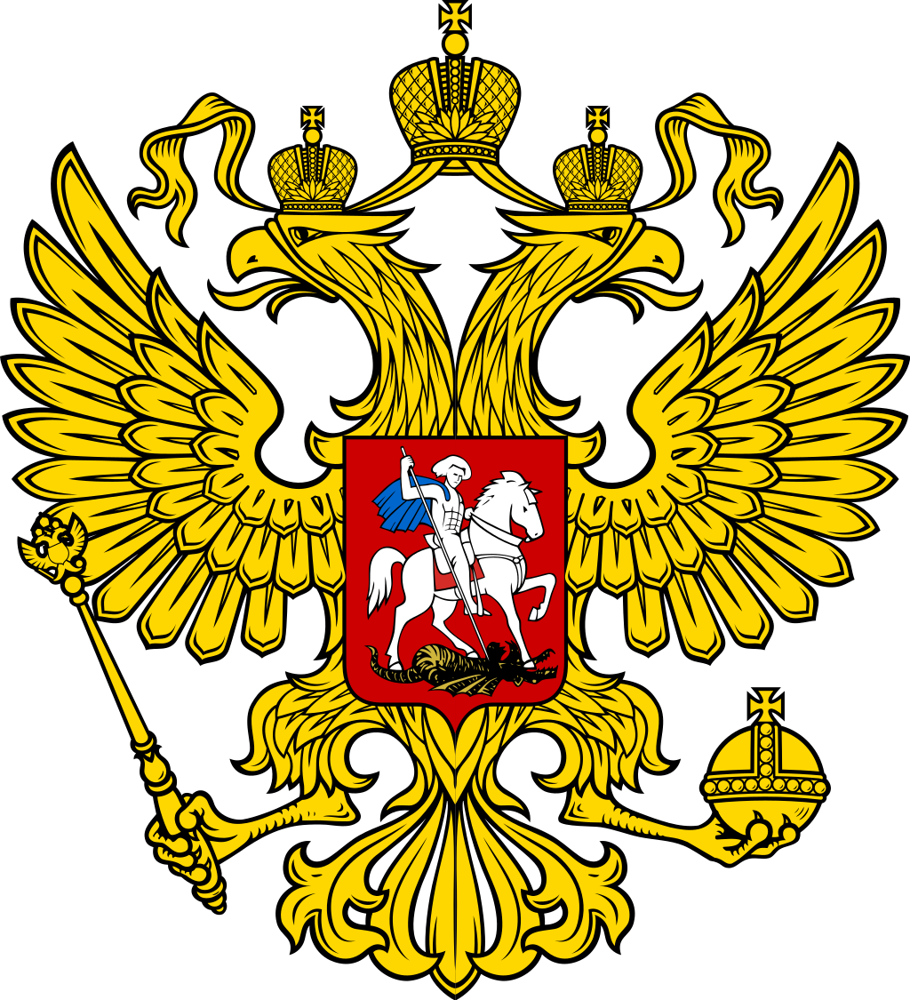

アークナイツのロゴとその由来となったロゴをまとめる。

オリジナル不明のロゴも分かり次第更新する。

| アークナイツ | オリジナル |
|:---:|:---:|
|ライン生命   | arduino   |
|クロージャ　  | github   |
|ウルサス   | ロシア国章   |
|ヴィクトリア   |イギリス国章    |
|シラクーザ   | イタリア国章+ ヴェネツィアの獅子   |
|使徒   |アスクレピオスの杖 |
|極東 |家紋 |

