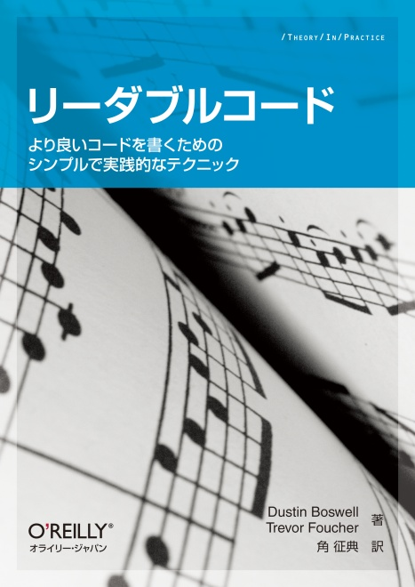

## しろくまちゃんのほっとけーき

作者：わかやま けん  
出版社：こぐま社  
初版：1972/10/15

しろくまちゃんがホットケーキを母親と作る絵本。  
絵本の魅力がわからない年齢になってしまったが、幼少期の自分はこの本が大好きだった。母親に読んでもらったあと、おねだりしてホットケーキを作ってもらったのを思い出す。  
ASMR の原点は、幼少の記憶にある母親の絵本の読み聞かせなのかもしれない。

## インパクトの瞬間

作者：清水義範  
出版社：ちくま文庫  
初版：2009/01/10

言葉遊びを題材にした短編集。  
清水義範の文章はとにかく笑える。 小説とかエッセイでもない、とにかく人を笑かしてやる文章を書くといった姿勢がうかがえる。イメージがつかないと思うのでいくつか紹介する。  
『序文』では、架空の言語学者が打ち立てた「英語起源日本語説」という論文の序文を集めたものがそのまま短編になっている。『注釈物語』では、翻訳された海外の小説の注釈集を転載している。『乱心ディスプレイ』では、ある操作に対する機械のディスプレイ出力を載せている。  
これら 3 作品に共通するのは、文中に起承転結のような概念がないことと、断片的な情報から読者に背景を想像させる点である。意外な展開や小ネタも多く、陣内智則みたいなツッコミをいれたくなってしまう。  
文庫本のタイトルにもなった『国語入試問題必勝法』も収録されている。「最長と最短の選択肢は間違いである」といった的外れなテクニックで、大学入試を攻略させようとする家庭教師と生徒の話である。  
この本は清水義範の短編集でもユーモラスで奇抜な作品が多く収録されていて、おすすめである。

## ナポレオン狂

作者：阿刀田高  
出版社：講談社文庫  
初版：1982/07/15

ホラー短編集。  
概して長編小説は、ページ数の減り方で物語が終わりに近づいていることがなんとはなしに気づいてしまう。その点、短編は最後の一遍を除けばいつ終わるのかが予測できない。それは、この作者が得意とする最後の 1 ページでハッとさせられる短編にはうってつけである。どんでん返しがあると言うよりは、最後の最後に物語の真相が暴かれるといったほうが近い。  
特に面白いのが『来訪者』という作品だ。文章だけでこれほどおぞましく恐ろしい思いを感じさせられるとは、と思って驚いた。  
直木賞を受賞している。

## 高３スーパー α 物理

作者：不明  
出版社：駿台文庫？  
初版：不明

駿台予備校の授業用テキスト。非売品。  
前期用テキストと後期用テキストがあるが、好きな本は前期の方だ。  
高校のカリキュラムでは教わらない、微積物理をベースにしたテキストで、物理の全分野をおさらいできる。微積を使って運動方程式を立てることを理解すると、問題の状況がとにかく整理しやすくなる。例題は各分野で 2,3 問程度だが、これだけで十分応用が効く良問揃いだ。  
物理の参考書として使うには内容が薄いのであくまで問題集として好きな本である。5 周した。

## リーダブルコード

作者：Dustin Boswell、Trevor Foucher  
出版社：オライリー・ジャパン  
初版：2012/6/23

コーディングテクニック本。  
分かりづらいコードが分かりやすくなる実例を紹介して、どのような戦略が背景にあるかを述べている。話し言葉の文体で、例として紹介されるコードも容易に理解できる。一方で、書かれている知識やテクニックを自分のコードに昇華させるのは別問題であり、それが鬼門だ。コーディングするとき、そのようなテクニックを覚えていられないのである。  
翻訳本特有のユニークな文体と、コミカルな挿絵があって、読み物として純粋に面白いため、一読する人だけでも十分楽しめると思う。だが、そのテクニックを自分のものにしたいなら何回も読む必要はあるだろう。  
好きな本にリーダブルコードがあると、できるプログラマーって感じしない？  
そうでもないか。

## おまけ

## ねないこだれだ

作者：せなけいこ  
出版社：福音館書店  
初版： 1969/11/10

**嫌いである。**
こわい。
