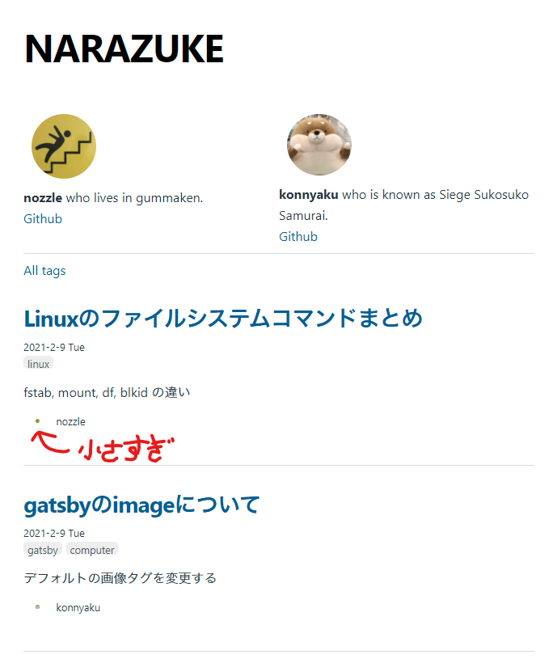
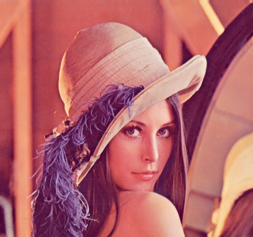

## 経緯

CSS がコンフリクトした


## 理由

> markdown に画像をアップロードしても自由にクラスを指定できず細かい設定ができない!!!

引用元:[gatsby の image について](https://narazuke.github.io/gatsby_image/)

## 解決策

CSS の部分文字セレクタを使って alt 属性の部分一致を使う。

## 解説

- `[foo^="bar"]{}` : foo 属性の bar 前方一致
- `[foo$="bar"]{}` : foo 属性の bar 後方一致
- `[foo*="bar"]{}` : foo 属性の bar 部分一致

## 使用例

### 基本

```markdown

```


### 反転

src/style.css に、alt 属性に`--reverse`が含まれると反転する CSS を書く。  
img と[]の間に空白があると失敗します。

```css:title=src/style.css
/* alt属性に--reverseを含むと左右反転する */
img[alt*="--reverse"] {
  transform: scale(-1, 1);
}
```

```markdown

```


反転できている。

### パディング

src/style.css に、alt 属性に`--my-padding` を含むと padding を設ける CSS を書く

```css
/* alt属性に--my-paddingを含むと上下に10%, 左右に25%の空白を作る */
img[alt*="--my-padding"] {
  padding: 10% 25%;
}
```

```markdown

```


できている。  
このページを再読み込みしてほしい。padding した領域に一瞬ブラーの残像が表示されるのが分かると思う。
gatsby-image の blur-up で読込中にブラーを表示する設定にしているためである。この時表示される base64 の画像には CSS が適用されないため、このような表示になってしまう。

### マージン

src/style.css に、alt 属性に`--my-margin` を含むと margin を設ける CSS を書く  
通常の場合 gatsby-image の CSS が優先されてしまうため、CSS に`!important`をつけて、style.css を優先させる。

```css
/* alt属性に--my-marginを含むと上下左右15%の空白を作る */
img[alt*="--my-margin"] {
  margin: 15% !important;
}
```

```markdown

```


...  
...  
...  
...  
blur-up の画像がずれて、読み込み中とは思えないおかしな挙動に見える。

## まとめ

alt 属性を利用した Markdown の画像への CSS の適用法は、個々の記事ですこしだけ装飾したい時などに便利である。 もしこの方法で padding や margin を作るときは、blur-up の設定は削除したほうが良いかもしれない。
