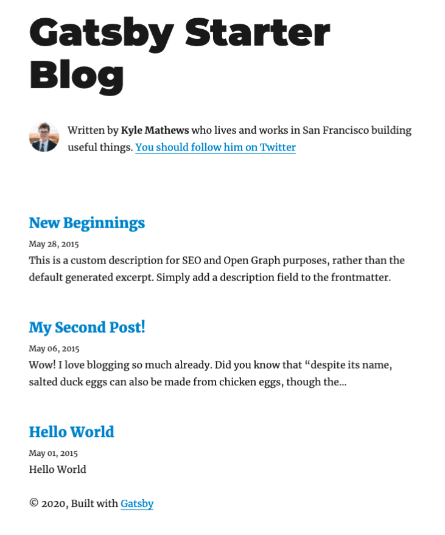

# Windows編
## nvm-win導入
nodeがもう入ってるという人は読み飛ばしていい。  
まず、nvmをインストールする。
nodeのバージョンを複数管理できて便利。  
[nvm-windows](https://github.com/coreybutler/nvm-windows/releases) にアクセスして、`nvm-setup.zip`をダウンロードする。
2021/01/31時点での最新版は`1.1.7`  

`nvm-setup.exe`を起動して、ウィザードに従う。
抱き合わせの怪しいソフトは無いので安心。  

Finishedが出たらコマンドプロンプトかPowershellを開く。  
`nvm version`と入力して自分がインストールしたnvmのバージョンが出たら成功。  
```powershell
PS C:¥Users¥hoge> nvm version           # nvmのバージョン表示
1.1.7
```

## nodeをインストール
`nvm list available`でインストールできるnodeを吟味しよう。  
最新版だとgatsbyが対応していない可能性もあるので、LTSにあるバージョンが盤石に思える。  
選んだら、`nvm install x.y.z`でインストールする。  
自分の環境ではv14.5.0をインストールした。
```powershell
PS C:¥Users¥hoge> nvm list available    # インストール可能なnodeのversion表示
PS C:¥Users¥hoge> nvm install x.y.z     # バージョンx.y.zをインストールする
```

終わったら`nvm use x.y.x`でバージョンを選択する。
`node --version`で`x.y.zと表示されたら成功。
```powershell
PS C:¥Users¥hoge> nvm use x.y.z         # nodeのバージョン選択
PS C:¥Users¥hoge> node --version        # nodeのバージョンを表示
x.y.z
```

参考: [Node.js のバージョン管理ツール nvm の使い方](https://laboradian.com/how-to-use-nvm/)

## gatsbyをインストール
### npmを用いたインストール
```powershell
PS C:¥Users¥hoge> npm install -g gatsby-cli     # gatsbyをインストール
PS C:¥Users¥hoge> npm install -g yarn     # gatsbyをインストール
```
ちょっとここから、本筋とは無関係なnpmに関する全般的な備忘録が続く。
### npmとは？

ここらへんは自分も曖昧なので詳しい人の解説を見よう。
>Node.js のパッケージを管理するための CLI であり、パッケージを作成したり、NPM 上のパッケージをローカルにインストールしたり、自分のパッケージを NPM に公開したりと、Node.js の開発に欠かせないツールである。Node.js をインストールすると自動的に npm もインストールされる。  

引用元: [【初心者向け】NPMとpackage.jsonを概念的に理解する](https://qiita.com/righteous/items/e5448cb2e7e11ab7d477)

`pip`が[pypi.org](https://pypi.org)で管理されてるのと同様に、`npm`は[NPM](https://www.npmjs.com)で管理されてると考えて良い。  

### npmのインストール先
#### グローバルインストール
`npm`のインストール時、`-g`オプションを付けるとグローバルインストールとなり、どのディレクトリからも使用可能なコマンドとなる。  
グローバルインストールの場合、モジュールは`npm`と同じ階層のディレクトリにインストールされる。  
`nvm-windows`で`node`を導入した方は、`C:\Users\[username]\AppData\Roaming\nvm\v14.5.0\node_modules`を参照すれば、`gatsby-cli`ディレクトリが確認できるはず。

#### ローカルインストール
`-g`を**付けない**と、カレントディレクトリの`node_modules`にインストールされる。

## gatsby構築環境を作る
サイトのフォルダを置く場所まで移動しよう。

```powershell
PS C:¥Users¥hoge> gatsby new [username].github.io https://github.com/gatsbyjs/gatsby-starter-blog       # gatsby謹製スターターキットをローカル環境に作る
```
[username]を自分のgithubのアカウント名にしておくと、Github Pagesで連携できる。  

gatsby-starter-blog以外にも素敵なスターターがたくさんある。  

なお、gitがWindowsに入ってない場合、このコマンドに失敗する。
入れよう。  
[自宅PCにGit for Windowsをインストールする手順](https://qiita.com/kamishi/items/5a3eed06c122f28fe2ea) というqiitaの記事が分かりやすかった。  

## gatsbyをローカル環境で動かす
`gatsby develop`でサーバを起動
```powershell
PS C:¥Users¥hoge> gatsby develop       # ローカルのサーバ起動
```
ブラウザで`https://localhost:8000`にアクセスすると、スターターブログが公開されているはず。ひとまずおめでとう！

## Github Pagesを使って公開する
`gh-pages`を導入してDeployする
```powershell
PS C:¥Users¥hoge> yarn add --dev gh-pages   # package.jsonのdevDependenciesにgh-pagesをインストール
PS C:¥Users¥hoge> yarn run deploy           # gh-pagesを使って[username].github.ioにdeploy
```
すると、WindowsならGithubのアカウント認証のポップアップが出てくる。
メールアドレスとパスワード、もしくはアクセストークンで認証する。
```powershell
...
Published
Done in xx.xxs.
```
と表示されたら完了。

[username].github.ioにアクセスするとdeployしたサイトが公開されている。
おめでとう！
## トラブルシュート: ERROR #11321 PLUGIN
### 問題
`yarn run deploy`する時に、エラーが吐かれることがある。  
```powershell
"gatsby-plugin-manifest" threw an error while running the onPostBootstrap lifecycle:
```


### 対処法
`package-lock.json`と`node_modeles`の中身を全部消して、`npm install`する。
```powershell
PS C:¥Users¥hoge> rm node_modules
PS C:¥Users¥hoge> rm package-lock.json
PS C:¥Users¥hoge> npm install
```