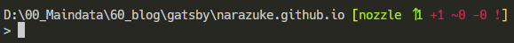

## 経緯

「気づいたら develop ブランチで作業してたわ、すまん」  
「俺もだったわ」

## posh-git とは

> posh-git is a PowerShell module that integrates Git and PowerShell by providing Git status summary information that can be displayed in the PowerShell prompt

引用元:https://github.com/dahlbyk/posh-git

posh-git とは、PowerShell に git のステータスを出せるモジュールである。ブランチ名が表示されるので、ヒューマンエラーの削減に期待できる。ブランチ名やアンステージドなファイルを tab キー補完してくれる機能も搭載。git ユーザ垂涎のモジュールだ。  
私の実行環境は PowerShell 7.1.1。 posh-git は 6.x とあったが問題なく導入できた。

## PowerShell のプロファイルの場所

```PowerShell
echo $profile
```

`D:\Documents\PowerShell\Microsoft\PowerShell_profile.ps1`だった。君はどうだ？

## Git のパス確認

```PowerShell
gcm git
```

## posh-git を導入

README に従って、`~/git`の中に入れることにしました。

```bash
mkdir git
cd ~/git
git clone git@github.com:dahlbyk/posh-git.git   # posh-gitをgit clone
```

## プロファイルに追記する

```PowerShell
code $profile       # VScodeでMicrosoft.PowerShell.ps1を編集する
```

vim でも emac でも nano でも良いよ。
エディタで以下の内容を追記する。

```PowerShell
Import-Module '~/git/posh-git/src/posh-git.psd1'        # posh-gitを読み込ませる
$GitPromptSettings.DefaultPromptBeforeSuffix.Text = '`n'    # ブランチ名の後、改行する
```

## プロファイルを読み込む

```PowerShell
. $profile
```

  
表示がこうなってたら成功

## 表示の意味

### ローカル

解説を見るより、手を動かして仕様を確認したほうが断然理解が早い。  
空っぽのディレクトリに`git init`して適当なファイルを 3 つ作ると、以下のような表示が出る。


作成したファイルのうち、一つを`git add`してやると、以下のような表示になる。


残り 2 つも`git init`すると、以下のような表示に変わる。


### リモート

github でリポジトリを作る。

```PowerShell
git remote add origin git@github.com:nozzlex3/posh-git_test.git     # リモートリポジトリを指定し、originと名付ける
git push -u origin master   # プッシュ先をoriginのmasterブランチ
```

表示がこうなる。  
≡ はローカルブランチとリモートブランチが同一であることを表している。


ローカルブランチで新しくコミットがあると、↑+数字で何コミット進んでいるかが表示される。


## トラブルシュート:追加したファイル数と posh-git の表示数が合わない、足りない

### 対処法

正しい表示なので問題ない。

### 解説

`posh-git`の表示はおそらく、`git status`の結果を表示している。そのため、複数ファイルを追加していてもそれらが同一のディレクトリに追加されている場合、`git add`するのはそのディレクトリ 1 つで済む。まずは`git status`の出力と表示数を見比べてみよう。
